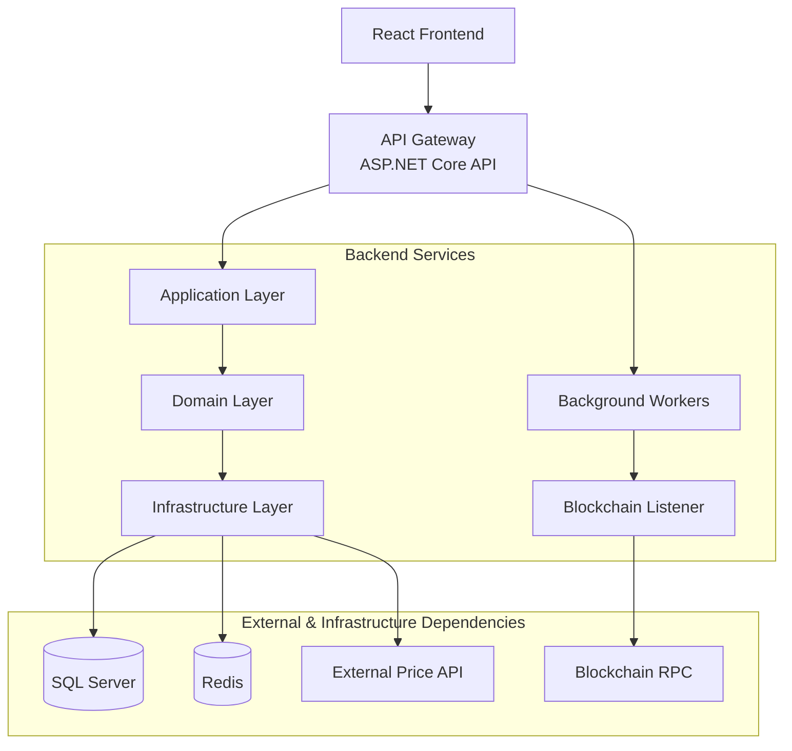

# Waillet

A custodial crypto wallet web app that allows users to:

- Hold crypto (BTC, ETH)
- Convert between assets
- Track portfolio
- View transaction history

*This is a personal coding project. Not going to be lanuched.*

## High-Level System Architecture

### Frontend

- React (vite)
- Auth UI
- Dashboard 
- Swap screen 
- History

### Backend 

- .NET API

Core services:

- Auth Service
- Wallet Service 
- Ledger Service 
- Blockchain Service 
- Conversion Service 
- Pricing Service

Infrastructure

- SQL Server (ledger + users)
- Redis (price cache)
- Blockchain RPC providers (Infura/Alchemy)
- Background workers

## High-Level System Architecture Diagram

## Core Domain Models

- User
- WalletAccount -> one account per user per asset (BTC, ETH)
- LedgerEntry -> records all transactions (deposits, withdrawals, swaps)
  - Id
  - WalletAccountId
  - AssetType (BTC, ETH)
  - Amount DECIMAL(38,8)
  - TransactionType (Deposit, Withdrawal, Swap, Fee)
  - Timestamp
- SwapTransaction -> internal swaps
- WithdrawalTransaction -> withdrawals to external addresses

